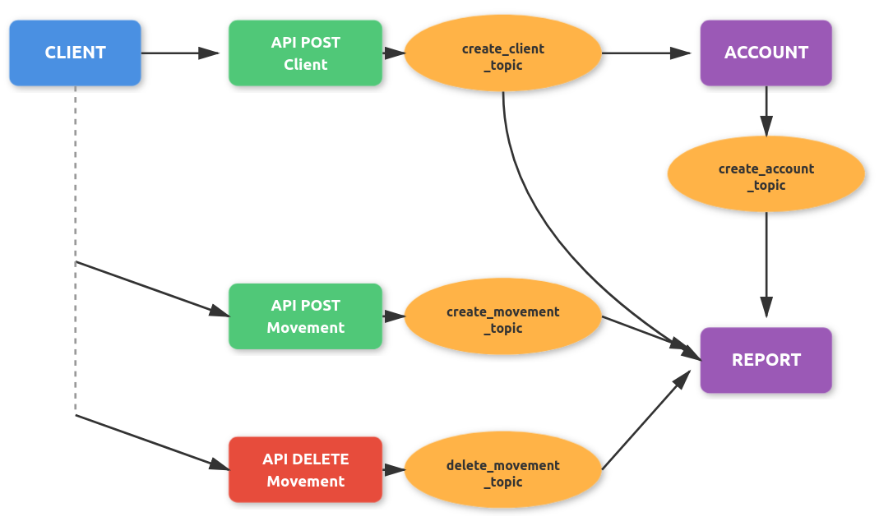

# 🏦 Bank Services – Microservicios


Sistema bancario basado en **arquitectura de microservicios**, desarrollado con **Spring Boot**, **Apache Kafka**, **PostgreSQL** y **Docker**, enfocado en buenas prácticas de diseño, mensajería asincrónica y pruebas. 

---
## 🧱 Arquitectura

El sistema está compuesto por dos microservicios independientes que se comunican de forma **asincrónica** mediante **Kafka**

---

## ❇️ Flujo de eventos


---

## ⚙️ Configuración

### Variables de entorno

Las configuraciones sensibles se externalizan usando variables de entorno:

```properties
spring.datasource.url=${SPRING_DATASOURCE_URL}
spring.datasource.username=${SPRING_DATASOURCE_USERNAME}
spring.datasource.password=${SPRING_DATASOURCE_PASSWORD}
```

---
## 📂 Estructura del proyecto

```text
bank-services/
│
├── client-person/
│   ├── src/main/java
│   ├── src/test/java
│   ├── Dockerfile
│   └── application.properties
│
├── account-movement/
│   ├── src/main/java
│   ├── src/test/java
│   ├── Dockerfile
│   └── application.properties
│
├── docker-compose.yml
└── README.md

```
---

## 🛠️ Stack

* Java 17+
* Spring Boot
* Spring Kafka
* Apache Kafka (KRaft mode)
* PostgreSQL
* Docker & Docker Compose
* JUnit 5 / Mockito
* Testcontainers (tests de integración)

---

## 🧪 Testing

Includes **unit and integration tests** for:

* Controllers
* Services

---

## 👤 Author

**Oscar Vega**
Backend Developer – Spring Boot | Microservices 
