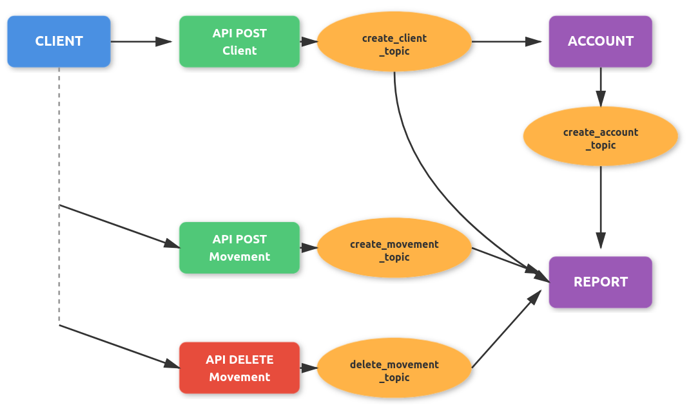

# 🏦 Bank Services – Microservices


Bank system based on **microservices and event-driven architecture**.

---
## 🧱 Architecture

System is divided into several microservices, each handling specific funtions. Below is provided an overview of each microservice:


### 1. API Gateway 🌐

* Description: The single entry point for all client requests, routing them to the appropriate microservices.
* Technology: Spring Cloud Gateway, and Redis.
* Features: Security handling, routing and rate limiting.

### 2. Authentication service 🔐

* Description: Handles user authentication, token and identity management.
* Technology: Spring Boot, Keycloak, and PostgreSQL.
* Features: User registration, login and authentication tokens.

### 3. Client service 🤵‍♂️

* Description: Manages client information.
* Technology: Spring boot, Keycloak, Spring Kafka, and PostgreSQL.
* Features: GET-POST-PUT-DELETE operations for clients.

### 4. Account-Movement service 💳

* Description: Manages account and movements information.
* Technology: Spring boot, Keycloak, Spring Kafka, and PostgreSQL.
* Features: GET-POST-PUT-DELETE operations for client and accounts.

### 5. Report service 🧾

* Description: Manages the detailed information of clients, accounts and movements.
* Technology: Spring boot, Keycloak, Spring Kafka, and PostgreSQL.
* Features: GET operation for reports.

### 🔁 Event flow


---

## ⚙️ Configuration

### Enviroment variables

Sensitive configuration for spring booot were stored in a .env file, such as:

```properties
SPRING_DATASOURCE_URL: ${CLIENT_PERSON_URL}
SPRING_DATASOURCE_USERNAME: ${CLIENT_PERSON_USER}
SPRING_DATASOURCE_PASSWORD: ${CLIENT_PERSON_PASS}
```

---
## 📂 Project Structure

```text
bank-services/
│
├── common-lib/
│   ├── src/main/java/bank/common_lib
│   ├── enumeration
│   ├── event/dto
|
├── client-person/
│   ├── db/init
│   ├── src/main/java
│   ├── src/test/java
│   ├── Dockerfile
│   └── application.properties
│
├── account-movement/
│   ├── db/init
│   ├── src/main/java
│   ├── Dockerfile
│   └── application.properties
|
├── report-service/
│   ├── db/init
│   ├── src/main/java
│   ├── Dockerfile
│   └── application.properties
│
├── docker-compose.yml
└── README.md

```
---

## 🛠️ Stack

* Java 17+
* Spring Boot
* Spring Kafka
* Spring Cloud
* Apache Kafka (KRaft mode)
* Keycloak
* Redis
* PostgreSQL
* Docker & Docker Compose
* JUnit 5 / Mockito
* Testcontainers

---

## 🧪 Testing

Includes **unit and integration** for client-person service:

* Controllers
* Services

---

## 🌱 Future imrpovements

* Use **SPRING CLOUD GATEWAY** for load balancing.
* Implement GitHub Actions for CI/CD pipelines

---

## 👤 Author

**Oscar Vega**
Backend Developer – Spring Boot | Microservices 
